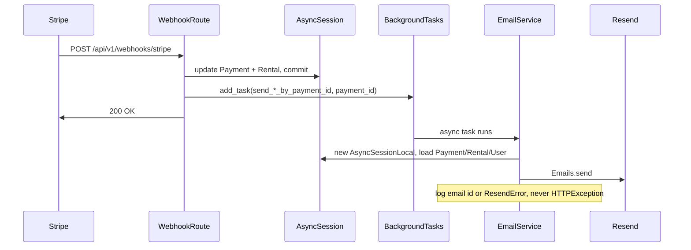

# Email Service Implementation — Resend + Webhook BackgroundTasks

*AI generated document reviewed and maintained by ma-alves.*

## Overview

Transactional emails are sent through the [Resend](https://resend.com) Python SDK (`resend>=2.30.1`), following the same service-layer pattern as `PaymentService` and Stripe: a class-based `EmailService` with private helpers for transport and templates, and public domain methods for business events.

Emails triggered by Stripe webhooks run **after** the database is updated, via FastAPI `BackgroundTasks`, so Stripe receives a fast `200` response and Resend failures never roll back payment state.

---

## Architecture



### Responsibilities

| Layer | Role |
|--------|------|
| [`app/routes/webhook_route.py`](../app/routes/webhook_route.py) | Verify Stripe signature, update DB, schedule background email tasks |
| [`app/services/email_service.py`](../app/services/email_service.py) | Load data, render HTML, call Resend, handle errors for background context |
| [`app/email_templates/`](../app/email_templates/) | Jinja2 HTML templates |
| [`app/settings.py`](../app/settings.py) | `RESEND_API_KEY`, `EMAIL_FROM` |

Orchestration stays in the route; the email service does not know about Stripe event types.

---

## Configuration

Add to `.env` (see [`.env.example`](../.env.example)):

```env
RESEND_API_KEY=re_xxxxxxxxxxxx
EMAIL_FROM=Costume Rental <noreply@yourdomain.com>
```

For local testing without a verified domain, Resend allows `onboarding@resend.dev` as the sender address.

| Variable | Purpose |
|----------|---------|
| `RESEND_API_KEY` | API key from Resend Dashboard → API Keys |
| `EMAIL_FROM` | `Name <email@domain>` used in the `from` field of every send |

---

## EmailService design

### Resend SDK wiring

The project uses the official SDK (not raw `httpx`), aligned with how Stripe uses `StripeClient`:

```python
import resend
from resend.exceptions import ResendError

class EmailService:
    def __init__(self):
        resend.api_key = Settings().RESEND_API_KEY
        self.email_from = Settings().EMAIL_FROM
```

Sending is done via the module-level API:

```python
resend.Emails.send(params)  # returns SendResponse with id: str
```

Errors are caught as `ResendError` (not `HTTPException`) in webhook-facing methods.

### Method layering

| Method | Returns | Errors | Called by |
|--------|---------|--------|-----------|
| `_render_template(name, ctx)` | `str` | propagates | internal |
| `_send(params)` | `SendResponse` | propagates | internal, unit tests |
| `_load_payment_for_email(payment_id)` | `Payment \| None` | propagates | internal |
| `send_payment_receipt_by_payment_id` | `None` | catch `ResendError`, log | webhook BG |
| `send_payment_failed_by_payment_id` | `None` | catch `ResendError`, log | webhook BG |
| `send_refund_notice_by_payment_id` | `None` | catch `ResendError`, log | webhook BG |

### Why `async` and a new DB session?

Background tasks run **after** the HTTP response. The request-scoped `AsyncSession` from `get_session` is already closed, so each send method opens a fresh session with `AsyncSessionLocal` and loads:

- `Payment` by `payment_id`
- `Rental` and `User` via `selectinload` (customer on the rental)

### Why pass `payment_id` only?

`BackgroundTasks.add_task` must not receive SQLAlchemy instances from the request session — they become detached or expired. Passing an integer ID keeps the task serializable and safe across process boundaries (same pattern will work if you later move to ARQ/Celery).

### Why `-> None` and no `HTTPException`?

FastAPI discards the return value of background tasks. There is no HTTP client left to map exceptions to status codes. Webhook-facing methods:

- Log `response.id` on success
- Log full traceback on `ResendError`
- Never raise — Stripe already received `200` and the DB commit succeeded

### Recipient

Emails go to `rental.users.email` — the user linked on the rental (`Rental.user_id`), typically the customer who booked the costume.

### Module singleton

```python
email_service = EmailService()
```

Imported in `webhook_route.py`, same pattern as `payment_service` in `payment_route.py`.

---

## HTML templates

Located under [`app/email_templates/`](../app/email_templates/):

| Template | Stripe event | Subject pattern |
|----------|--------------|-----------------|
| `payment_receipt.html` | `payment_intent.succeeded` | `Payment Receipt — {currency} {amount}` |
| `payment_failed.html` | `payment_intent.payment_failed` | `Payment Failed — Rental #{id}` |
| `refund_notice.html` | `charge.refunded` | `Refund Processed — Rental #{id}` |

Templates are loaded with Jinja2 `FileSystemLoader` (available via FastAPI’s dependency tree). Amounts in templates use major currency units (`payment.amount / 100`, `payment.refunded_amount / 100`).

---

## Webhook integration

[`app/routes/webhook_route.py`](../app/routes/webhook_route.py) injects `BackgroundTasks` on `POST /api/v1/webhooks/stripe`.

Each private handler commits payment/rental state and **returns `payment.id` or `None`**:

| Stripe event | Handler | Email task |
|--------------|---------|------------|
| `payment_intent.succeeded` | `_handle_payment_succeeded` | `send_payment_receipt_by_payment_id` |
| `payment_intent.payment_failed` | `_handle_payment_failed` | `send_payment_failed_by_payment_id` |
| `charge.refunded` | `_handle_charge_refunded` | `send_refund_notice_by_payment_id` |

Scheduling example:

```python
payment_id = await _handle_payment_succeeded(payment_intent, session)
if payment_id:
    background_tasks.add_task(
        email_service.send_payment_receipt_by_payment_id,
        payment_id,
    )
```

Rules:

1. Schedule only when `payment_id` is not `None` (payment row existed and was updated).
2. Handlers commit before returning the ID; the background task runs after the webhook response.
3. Email failures must not change the webhook HTTP status.

---

## Testing

[`tests/test_email_service.py`](../tests/test_email_service.py) covers:

- Template rendering
- `_send` with patched `resend.Emails.send`
- Each `send_*_by_payment_id` method (success path, `ResendError` swallowed, skip when payment missing)

Run:

```sh
uv run pytest tests/test_email_service.py -vv
```

Webhook route integration tests in `tests/test_webhook_route.py` remain commented out (Stripe domain / signature requirements).

---

## Files

| File | Purpose |
|------|---------|
| `app/services/email_service.py` | `EmailService` + `email_service` singleton |
| `app/routes/webhook_route.py` | Stripe webhooks + `BackgroundTasks` scheduling |
| `app/email_templates/*.html` | Transactional HTML |
| `app/settings.py` | `RESEND_API_KEY`, `EMAIL_FROM` |
| `.env.example` | Documented env vars |
| `tests/test_email_service.py` | Unit tests |

---

## Follow-ups (not implemented)

- `email_route.py` — admin-only test endpoint to trigger sends manually
- Welcome / rental confirmation emails from `user_service` / `rental_service` (same `BackgroundTasks` pattern)
- Job queue (ARQ, Celery) — reuse `send_*_by_payment_id`; only the dispatcher changes
- Uncomment / extend `tests/test_webhook_route.py` when Stripe webhook testing is set up

---

## Resend setup checklist

1. Sign up at https://resend.com
2. Verify a domain (or use `onboarding@resend.dev` for dev)
3. Create an API key → set `RESEND_API_KEY`
4. Set `EMAIL_FROM` to a sender allowed by your Resend account
5. Ensure Stripe webhooks forward `payment_intent.succeeded`, `payment_intent.payment_failed`, and `charge.refunded` to your `/api/v1/webhooks/stripe` endpoint
